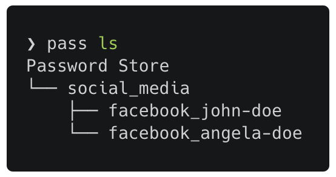
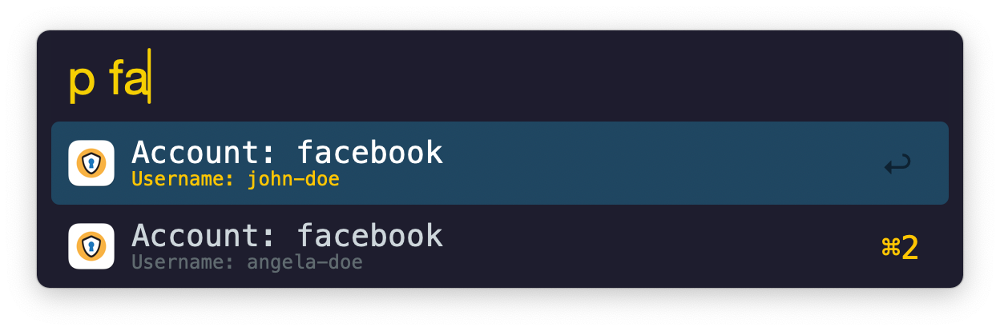
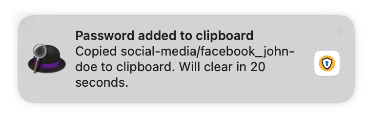

<h1 align="center">
	<a href='#'></a>
	</br>pass workflow
</h1>

Alfred workflow that retrieve passwords from [pass](https://www.passwordstore.org/) (password-store).

## Precondition

1. Install pass: `brew install pass` and initialize the it.
2. Insert new entry into your password-store, simply execute:<br> `pass insert <serviceName>_<username>`.\
In this example, I've also created a category to the service by:<br> `pass insert <category>/<serviceName>_<username>`.

	```shell
	❯ pass insert social_media/facebook_john-doe
	```

<p align="center">
	
</p>

3. Modify the entry and append the following fields by executing:<br> `pass edit <category>/<serviceName>_<username>`:

	```shell
	❯ pass edit social_media/facebook_john-doe
	supersecuredpassword!
	Account: facebook
	Username: john-doe
	```

## Usage

The default keyword is `p`. which requires at least 2 chars to trigger the search.

When hitting `⏎ Return` on a selected item, the password is copied to the clipboard for 20 seconds and won't be displayed inside Alfred clipboard.

<p align="center">
	
	
</p>

## Acknowledgements

The following resource were used when creating this workflow:

* The excellent [alfred-password-store](https://github.com/exaroth/alfred-password-store) by [Konrad Wąsowicz](https://github.com/exaroth).

A big ♥️ _thank you_!